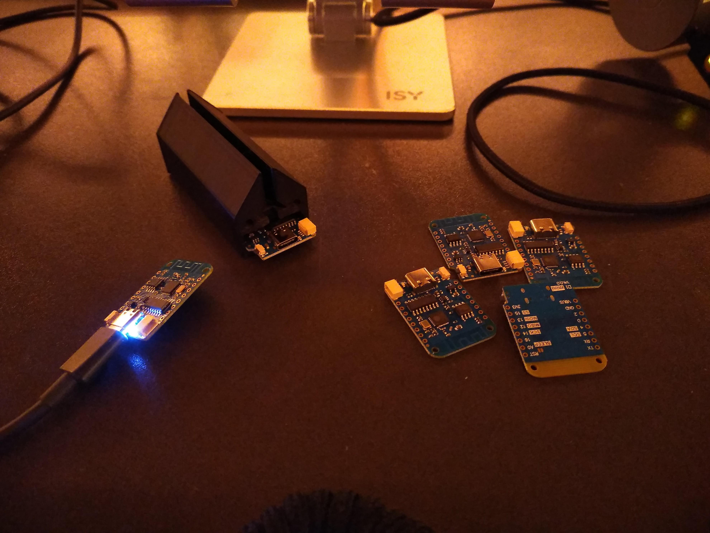

# LEDrail

A parameterized 3D printed rail for controllable LED strips and a sheet of acrylic glass. This repo provides files, description and learnings on the 3d printing of the rail and laser engrave process.

## Specs

- 18x SK6812/WS281x LEDs (if 300mm length)
- 570mA max. current draw
- USB-C
- WLED with all its features

## Reproduction

### Ingredients

- PMMA acrylic glas (the cheap stuff is often PS and not real PMMA. That creates probels when working with a laser)
- ESP8266 D1 Mini v4
- Around 150 gramm of filament
- WLED
- 300mm (customizable) LED strip, best with 60 LED/m
- Two screws
- Glue
- Three short pieces of wire, preferably different colores

### Print the components

The 3D model source is written in OpenSCAD in [ledrail.scad](ledrail.scad). It is exported into two STL files:

- [ledrail.stl](ledrail.stl)
- [ledrail_side_plate.stl](ledrail_side_plate.stl)

The first one is the main component which will hold everything together. The side-plate has screw holes for easy removal in case of maintenance.

It may be necessary to split the model in half if the printer is not big enough (a bit more than 30x30x300 mm). In any case support can be reduced by printing it vertically with the esp compartment facing upwards.

### Engrave the PMMA acrylic glas

Some general learnings:

- Use a cutable (non-melting) protective tape, big enough to protect the working area, so hot material removed by the laser does not damage surrounding material. The perfect choice would be transfer tape, which is often used to apply stickers. Ask in your local copy shop.
- Mirror whatever you want to engrave and engrave it into the back of the material. The reason for this is that you otherwise get reflections inside the acrylic when engraving into the front. This effect gets stronger when the acrylic gets thicker. [Example image](./images/reflection.jpg)
- Depending on the vertical size of the sign, use thicker glass so the top gets enough ilumination. E.g. I found 4mm suitable for a height of 200mm height and 5mm for 300mm.

I was fortunate and found real Plexiglas® (which is PMMA) for 4€ per 200x300x4mm piece on eBay. This is also the maximum working size of the commonly used K40 CO2 Lasercutter in many hackspaces, and therefore the perfect size to keep in stock for any project ;)

### ESP wiring

The ESP can provide a maximum of 500mA to the strip. In addition the chip itself draws up to 70mA.

A data wire (white) is connected to GPIO2 and the strip input D. Heads up: Programmable LED strips are directional! So check for the small arrows printed on the PCB and solder the wire in the correct orrientation (Arrow points in the direction of the "data flow" through the strip).
The two power wires go to GND and VBus. VBus is also sometimes labeled as VIn or just 5V, depending on the brand of ESP8266.

A cable length of roughly 35mm is advised.

### Install & Configure WLED

If you use a Chromeium-based browser, you can use Web-USB and easily flash your ESP in the browser. Just connect it via USB, visit [install.wled.me](https://install.wled.me) and follow the instructions. This will also ask for your wifi credentials and already configure the ESP accordingly.

If you want to go the manual way, you can download the latest version from their [Github Releases](https://github.com/Aircoookie/WLED/releases) page, and follow [their documentation](https://kno.wled.ge/basics/install-binary/).
You can then configure wifi access either via the serial connection over USB-C or the fallback hotspot the ESP will open up after a short delay. 

In the configuration menu under "LED Preferences", make sure to set the following three values:

- Max power draw to 500mA
- LED strip to SK6812 or WS281x depending on your strip
- Number of LEDs to 18

### A note on the OpenSCAD code

The code is pretty bad, really repetitive but does it's job. It's a simple model and there is a lot of refactoring in order. Feel free to send a merge request or meet up to discuss techniques over a cup of coffee.

You'll find two main variables at the top of the file to control the size of the acrylglas the rail is printed for.

The side-plate is "hidden" (via the "*" operator). To output stl files for the side plate(s) use the "!" operator instead.

# More pictures

